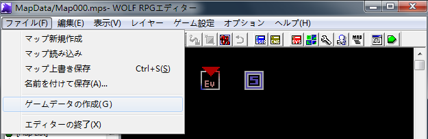
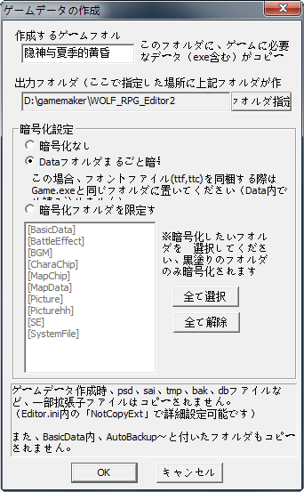

# Wolf RPG游戏汉化翻译全流程说明
Wolf RPG是很流行的自制游戏引擎，可以制作RPG/角色扮演游戏、ADV/AVG/冒险游戏等，其制作工具为Wolf RPG Editor。下面介绍汉化Wolf RPG Game的流程。

## 一、所需软件
* 安装Wolf RPG Editor。下载后解压到文件夹http://www.silversecond.com/WolfRPGEditor/
* 安装touhouSE。下载后解压到文件夹https://resemblances.click3.org/product_list/index.cgi/detail/61
* 安装ruby。下载后按提示安装https://rubyinstaller.org/downloads/
* 安装Wolf Trans。下载后解压到文件夹https://github.com/springsin0/wolftrans
* 安装要翻译的日文游戏。通常是下载后解压到文件夹。

## 二、解包
用Wolf RPG Editor制作的日文游戏的数据通常是加密打包成.wolf文件发布的，可能有一个（游戏目录下data.wolf)或多个(游戏目录下Data\\*.wolf)，需要先解包。

打开touhouSE安装的文件夹，将.wolf文件拖拽到touhouSE.exe上，将在此文件夹下生成data文件夹，里面即是解包后的游戏数据。注意如果文件名里有日文，将会是乱码，比如这样 _娫堘偄扵偟  塀偟恄俀.png_ 。这没关系，就是要乱码才对，千万不要转码，否则反而会出错。同样的，下述操作打开各种软件如Wolf RPG Editor等时也不要转系统区域编码或者加载区域模拟软件等。

如果是一个.wolf文件，此时data文件夹下即是游戏运行所需要的所有数据文件；如果是多个.wolf文件，还需要将游戏安装的文件夹下Data\下的其他文件夹复制到这里的data文件夹下来。一个典型的游戏数据目录结构如下：

    ─data
        ├─BasicData
        ├─BattleEffect
        ├─BGM
        ├─CharaChip
        ├─MapChip
        ├─MapData
        ├─Picture
        ├─SE
        └─SystemFile

## 三、测试环境准备
1. 删除Wolf RPG Editor文件夹下原有的Data文件夹，然后将touhouSE文件夹下的data文件夹复制到Wolf RPG Editor文件夹

2. 运行Wolf RPG Editor(Editor.exe)，打开游戏基本设定（ゲーム設定-->ゲーム基本設定を開く）
   

   在如下图三个地方修改游戏标题、字体、语言编码。字体要写准确的中文或英文名称，比如"楷体"或"KaiTi"，"黑体"或"SimHei"。如不填则使用系统默认字体，简体中文系统是宋体。语言编码则选择目标翻译语言，如"中国語/簡体字"
   
   

3. 运行Game.exe开始游戏。这时你应该能看到一个除了标题栏的标题是中文外，其他都是乱码的游戏界面。这就对了，因为此时游戏内的文字还都是日文的WINDOWS_31J/CP932编码。确认游戏能运行后退出。

## 四、使用WolfTrans翻译
1. 建立一个文件夹`work_dir`，将已经解包的游戏数据文件的Data\BasicData\和Data\MapData\ 文件夹复制到`work_dir`。例如：

        xcopy "D:\WOLF_RPG_Editor2\Data\BasicData" "D:\transwork\Data\BasicData" /I
        xcopy "D:\WOLF_RPG_Editor2\Data\MapData" "D:\transwork\Data\MapData" /I

2. 运行wolftrans生成待翻译的txt文件到`patch_dir`。如

        ruby d:\wolftrans\bin\wolftrans "D:\transwork" "D:\transwork\patch" "D:\transwork\output" "GBK"

   一个典型的`patch_dir`文件夹结构如下：

        ─patch
            ├─Assets
            └─Patch
                └─dump
                    ├─common
                    ├─db
                    │  ├─CDataBase
                    │  └─DataBase
                    └─mps
   需要翻译的是里面的txt文件
   
3. 用文本编辑软件（如Notepad++）打开txt文件，进行翻译工作。如`patch_dir`\Patch\dump\mps\Map000.txt

   WolfTrans抽出的txt是由一个个类似这样的翻译段组成的：

        > BEGIN STRING
        【はじめから】
        > CONTEXT MPS:Map000/events/0/pages/1/36/Picture < UNTRANSLATED
        
        > END STRING

   \> BEGIN STRING和> CONTEXT之间的日语原文，不要动。翻译者只需要将译文填入最后一个> CONTEXT 和> END STRING之间即可

        > BEGIN STRING
        【はじめから】
        > CONTEXT MPS:Map000/events/0/pages/1/36/Picture < UNTRANSLATED
        【从头开始】
        > END STRING
        
4. 再次运行wolftrans（命令和步骤2完全一样不变）。程序将读取翻译修改后的txt文件内容，将其整合后重新生成游戏数据文件到`out_dir`。如

        ruby d:\wolftrans\bin\wolftrans "D:\transwork" "D:\transwork\patch" "D:\transwork\output" "GBK"
 
**警告：**  
**软件每次运行都会先清空`out_dir`的所有内容，请小心**  
**为了避免意外，防止翻译成果付之东流，请经常备份`patch_dir`里的内容。比如在再次运行wolftrans根据已翻译txt文件重新生成游戏数据文件前**  
**作者对使用此软件造成的任何损失概不负责**  

5. 复制`out_dir`下Data\BasicData\和Data\MapData\文件夹的内容到Wolf RPG Editor文件夹下Data\下的相应文件夹。如

        copy "D:\transwork\output\Data\MapData\*" "D:\WOLF_RPG_Editor2\Data\MapData\"
        copy "D:\transwork\output\Data\BasicData\*" "D:\WOLF_RPG_Editor2\Data\BasicData\"

6. 运行Wolf RPG Editor文件夹下的game.exe开始测试

之后重复步骤4至步骤6，直至所有需翻译内容翻译、测试、校对完毕。为方便操作，可以将这些内容写成一个test.bat文件，每次运行bat文件即可。

    ruby d:\wolftrans\bin\wolftrans "D:\transwork" "D:\transwork\patch" "D:\transwork\output" "GBK"
    copy "D:\transwork\output\Data\MapData\*" "D:\WOLF_RPG_Editor2\Data\MapData\"
    copy "D:\transwork\output\Data\BasicData\*" "D:\WOLF_RPG_Editor2\Data\BasicData\"
    start /b D:\WOLF_RPG_Editor2\game.exe

## 五、其他需要翻译的内容
比如图片等，请使用图片编辑软件处理，如iPhotoDraw

其他未尽事宜请直接使用Wolf RPG Editor处理

## 六、打包
Wolf RPG Editor里选择（ファイル-->ゲーマデータの作成），生成的游戏文件在Wolf RPG Editor文件夹下与游戏标题同名的文件夹内。

## 七、其他
* 日语原版游戏的存档与汉化/本地化后游戏的存档不兼容，如出错请删除Save文件夹
* 每次进行新的游戏汉化/本地化工作时，最好先少量翻译一点内容，走通从解包到打包的全部流程、全部理顺后再大量翻译。否则翻译到最后发现游戏无法运行就尴尬了。
